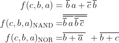
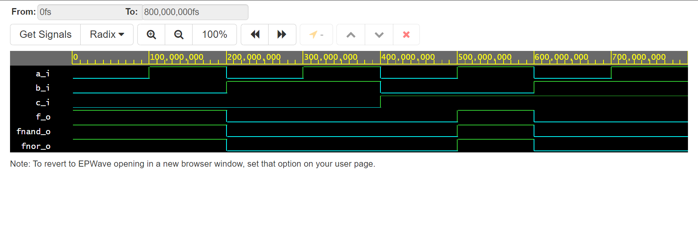
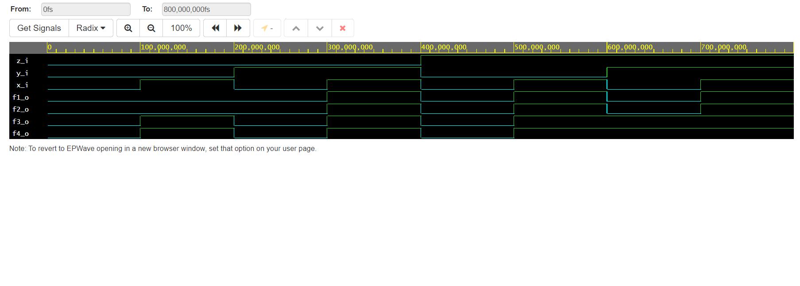

# Ivo Točený, 222683 - gates-01

## 1. part - Link to GitHub repository

[My GitHub repository](https://github.com/Ivo-Toceny-222683/Digital-electronics-1)

## 2. part - Verification of De Morgan's laws

### Equations from equation maker for more readability


### Source code from design.vhd of Architecture
```
------------------------------------------------------------------------
-- Architecture body for basic gates
------------------------------------------------------------------------
-- Usage of De Morgan laws on function f using nands and nors
architecture dataflow of gates is
begin
    f_o  <= ((not b_i) and a_i) or ((not c_i) and (not b_i));

    fnand_o <= not(not((not b_i) and a_i) and not((not c_i) and (not b_i)));

    fnor_o <= not(b_i or (not a_i)) or not(c_i or b_i);

end architecture dataflow;
```

### Table of function values of set variables
| **c** | **b** |**a** | **f(c,b,a)** |
| :-: | :-: | :-: | :-: |
| 0 | 0 | 0 | 1 |
| 0 | 0 | 1 | 1 |
| 0 | 1 | 0 | 0 |
| 0 | 1 | 1 | 0 |
| 1 | 0 | 0 | 0 |
| 1 | 0 | 1 | 1 |
| 1 | 1 | 0 | 0 |
| 1 | 1 | 1 | 0 |

### Screenshot with simulated time waveforms of f, fnand, fnor to see that it matches


### Link to my EDA Playground of De Morgan's laws
[De Morgan's Laws EDA Playground](https://www.edaplayground.com/x/6b4W)

## 3. part - Verification of Distributive laws

### Source code from design.vhd of Architecture
```
------------------------------------------------------------------------
-- Architecture body for basic gates
------------------------------------------------------------------------
-- Usage of De Morgan laws on function f using nands and nors
architecture dataflow of gates is
begin
    f1_o <= (x_i and y_i) or (x_i and z_i);
    f2_o <= x_i and (y_i or z_i);
    f3_o <= (x_i or y_i) and (x_i or z_i);
    f4_o <= x_i or (y_i and z_i);

end architecture dataflow;
```

### Screenshot with simulated time waveforms to see if f1 = f2, f3 = f4, which does


### Link to my EDA Playground of Distributed laws
[Distributed laws](https://www.edaplayground.com/x/EG7n)