# Ivo Točený, 222683 - 03-vivado

## PreLab homework:

### 0. part - Link to GitHub repository

[My GitHub 03-vivado repository](https://github.com/Ivo-Toceny-222683/Digital-electronics-1/tree/main/Labs/03-vivado)

### 1. part - Nexys A7 board switches-pins, leds-pins

**Active-high LEDs states**

**Switches** | **Pins** | **LEDs** | **Pins**
------------ | ---------- | -------| ------
SW0| J15     | LD0| H17
SW1| L16     |  LD1|K15
SW2|  M13    | LD2|J13
SW3| R15     |LD3|N14  
SW4| R17    |LD4|R18 
SW5| T18|LD5|V17 
SW6| U18|LD6|U17 
SW7| R13 |LD7|U16 
SW8| T8    |LD8|V16
SW9| U8    |LD9|T15
SW10| R16|LD10|U14  
SW11| T13 |LD11|T16  
SW12| H6 |LD12| V15
SW13| U12|LD13|V14
SW14|  U11 |LD14|V12
SW15|V10| LD15|V11  

# Lab assignment:

## Two-bit wide 4-to-1 multiplexer:

### VHDL code of two-bit wide 4-to-1 multiplexer:

```vhdl
------------------------------------------------------------------------
-- Architecture body for 2-bit wide 4-to-1 multiplexer
------------------------------------------------------------------------
architecture Behavioral of mux_2bit_4to1 is
begin
    f_o  <=    a_i when (sel_i = "00") else
               b_i when (sel_i = "01") else
               c_i when (sel_i = "10") else
               d_i;

end architecture Behavioral;
```

### VHDL testbench:

```vhdl
--------------------------------------------------------------------
    -- Data generation process
    --------------------------------------------------------------------
p_stimulus : process
begin
        -- Report a note at the beginning of stimulus process
        report "Stimulus process started" severity note;
        
        s_d <= "00"; s_c <= "00"; s_b <= "00"; s_a <= "00" ;
        s_sel <= "00" ; wait for 100ns;
        
        s_d <= "10"; s_c <= "11"; s_b <= "01"; s_a <= "10" ;
        s_sel <= "01" ; wait for 100ns; 
        
        s_d <= "00"; s_c <= "01"; s_b <= "01"; s_a <= "11" ;
        s_sel <= "00" ; wait for 100ns; 
       
        s_d <= "10"; s_c <= "10"; s_b <= "01"; s_a <= "00" ;
        s_sel <= "01" ; wait for 100ns; 
       
        s_d <= "11"; s_c <= "01"; s_b <= "11"; s_a <= "01" ;
        s_sel <= "11" ; wait for 100ns; 
       
        s_d <= "01"; s_c <= "10"; s_b <= "01"; s_a <= "00" ;
        s_sel <= "10" ; wait for 100ns;
       
        -- Report a note at the end of stimulus process
        report "Stimulus process finished" severity note;
        wait;
    end process p_stimulus;
```

### Simulated waveforms:


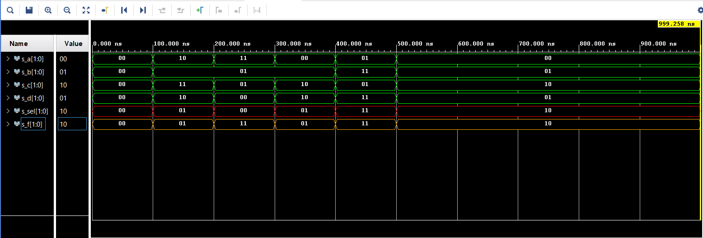

## Vivado tutorial:

### -> Create project, (press next if first time), project name, RTL project

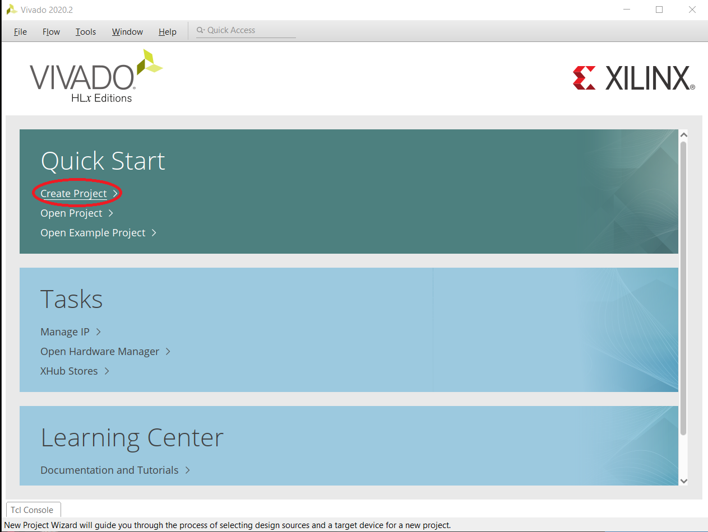

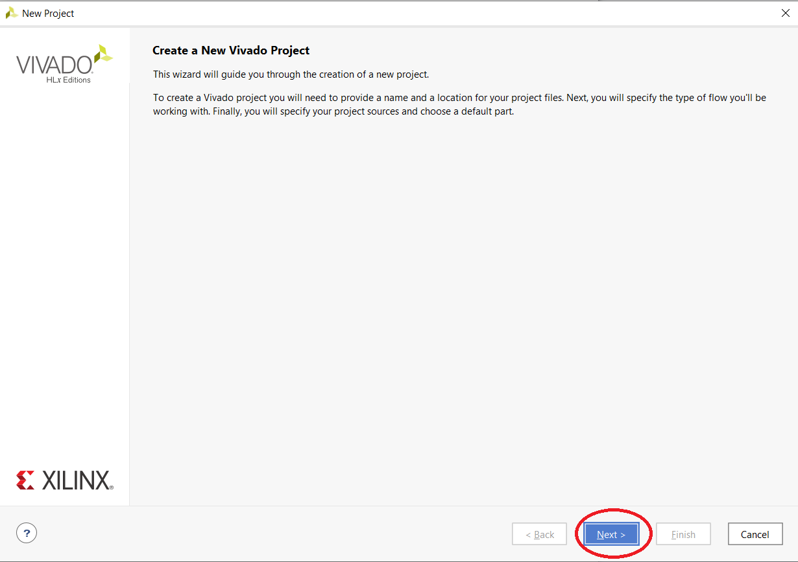

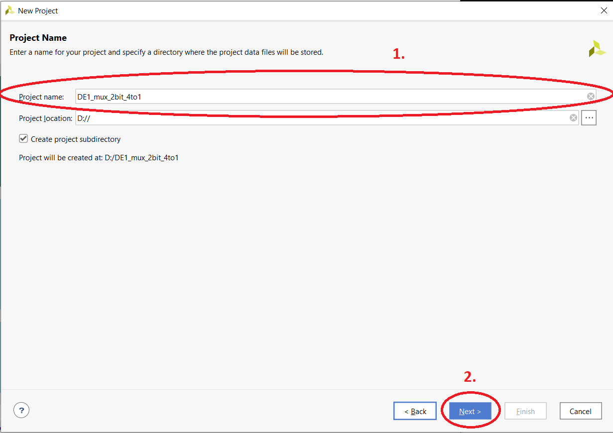

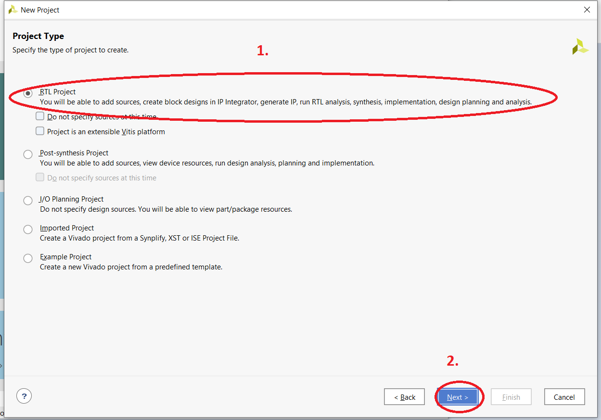

### -> Add sources[design] (create file,set vhdl,file name, ok, next)

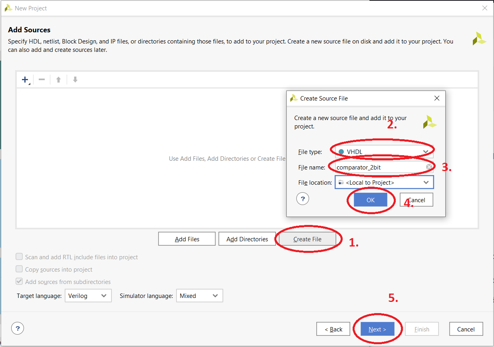

### -> (Optional, but can set now) Add constraints (create file, name, ok, next)

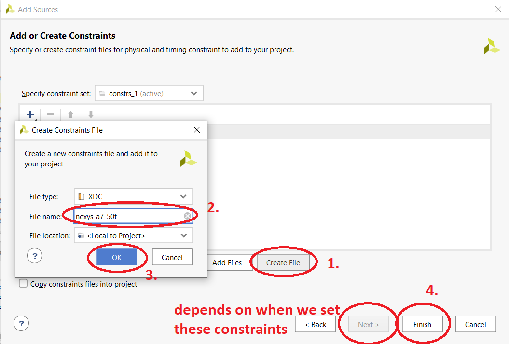

### -> Add board (Nexys for this course)

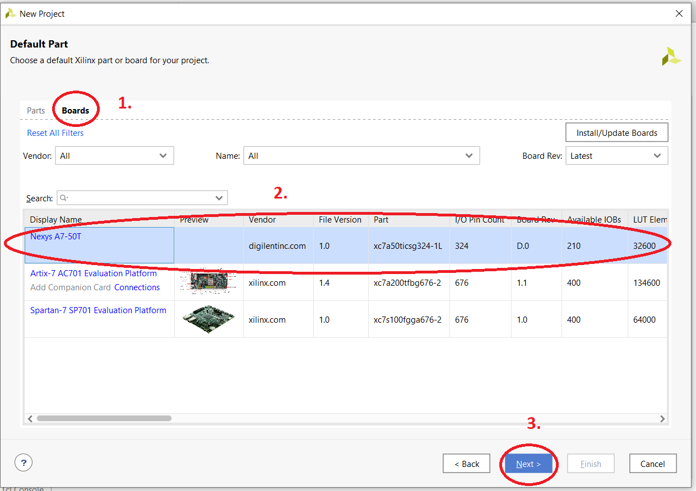

### -> Finish making project 

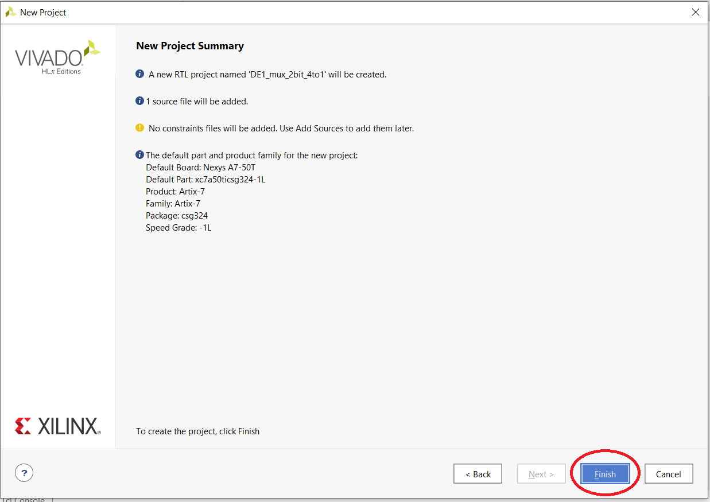

### -> Add simulation[same principle as design just add tb before name] (or constraints/design)

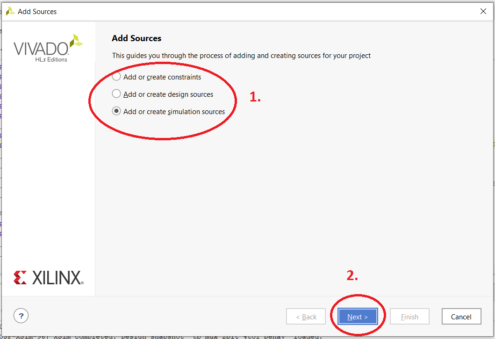

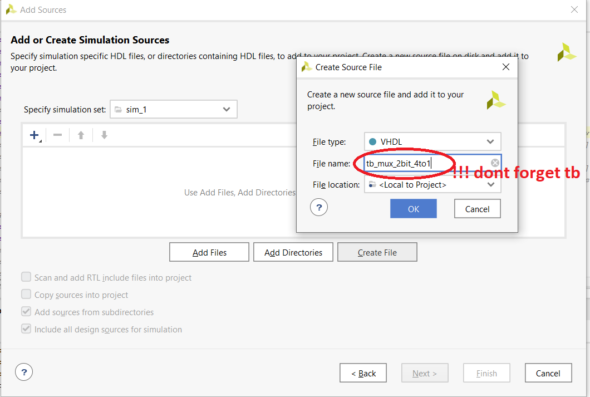