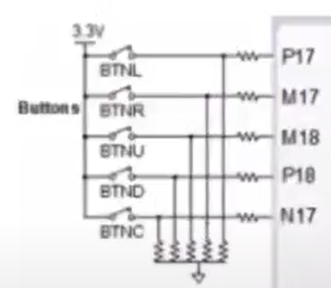
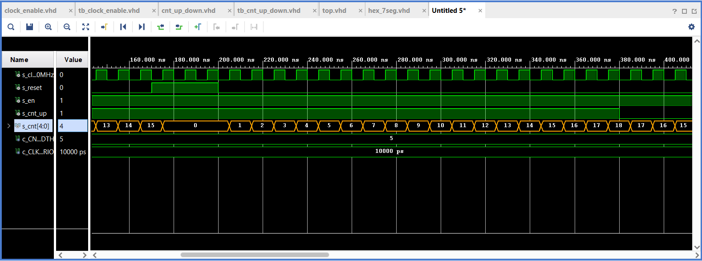

# Ivo Točený, 222683 - 05-counter

## 0. part - Link to GitHub repository

[My GitHub 05-counter repository](https://github.com/Ivo-Toceny-222683/Digital-electronics-1/tree/main/Labs/05-counter)

## 1. part

### Figure with connection of push buttons on Nexys A7 board



### Table with calculated values

| **Time interval** | **Number of clk periods** | **Number of clk periods in hex** | **Number of clk periods in binary** |
   | :-: | :-: | :-: | :-: |
   | 2&nbsp;ms | 200 000 | `x"3_0d40"` | `b"0011_0000_1101_0100_0000"` |
   | 4&nbsp;ms | 400 000 | `x"6_1A80"` | `b"0110_0001_1010_1000_0000"` |
   | 10&nbsp;ms | 1 000 000 | `x"F_4240"` | `b"1111_0100_0010_0100_0000"` |
   | 250&nbsp;ms | 25 000 000 | `x"17D_7840"` | `b"0001_0111_1101_0111_1000_0100_0000"` |
   | 500&nbsp;ms | 50 000 000 | `x"2FA_F080"` | `b"0010_1111_1010_1111_0000_1000_0000"` |
   | 1&nbsp;sec | 100 000 000 | `x"5F5_E100"` | `b"0101_1111_0101_1110_0001_0000_0000"` |

## 2. part

### VHDL code of the process p_cnt_up_down

```vhdl
p_cnt_up_down : process(clk)
    begin
       if rising_edge(clk) then
        
            if (reset = '1') then               -- Synchronous reset
                s_cnt_local <= (others => '0'); -- Clear all bits

            elsif (en_i = '1' and cnt_up_i = '1') then       -- Test if counter is enabled
                s_cnt_local <= s_cnt_local + 1;
                
            elsif (en_i = '1' and cnt_up_i = '0') then
                s_cnt_local <= s_cnt_local - 1;

            end if;
        end if;
    end process p_cnt_up_down;
```

### VHDL reset and stimulus processes from testbench file tb_cnt_up_down.vhd

```vhdl
--------------------------------------------------------------------
    -- Reset generation process
    --------------------------------------------------------------------
    p_reset_gen : process
    begin
        s_reset <= '1';
        wait for 20 ns;
        
        s_reset <= '0';
        wait for 150 ns;
        
        -- Reset activated
        s_reset <= '1';
        wait for 30 ns;
        
        assert ((s_cnt = "00000") and (s_cnt_up = '1') and (s_reset = '1'))
        report "Test failed for input combination: 0, 1, 1" severity error;

        s_reset <= '0';
        wait;
    end process p_reset_gen;

    --------------------------------------------------------------------
    -- Data generation process
    --------------------------------------------------------------------
    p_stimulus : process
    begin
        report "Stimulus process started" severity note;

        -- Enable counting
        s_en     <= '1';
        
        -- Change counter direction
        s_cnt_up <= '1';
        wait for 380 ns;
        
        assert ((s_cnt = "10010") and (s_cnt_up = '1') and (s_reset = '0'))
        report "Test failed for input combination: 18, 1, 0" severity error;
        
        s_cnt_up <= '0';
        wait for 220 ns;
        
        assert ((s_cnt = "11100") and (s_cnt_up = '0') and (s_reset = '0'))
        report "Test failed for input combination: 28, 0, 0" severity error;

        -- Disable counting
        s_en     <= '0';

        report "Stimulus process finished" severity note;
        wait;
    end process p_stimulus;
```

### Screenshot with simulated time waveforms

