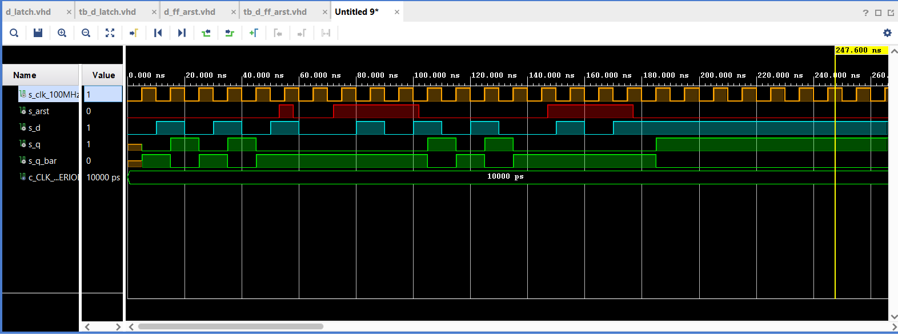
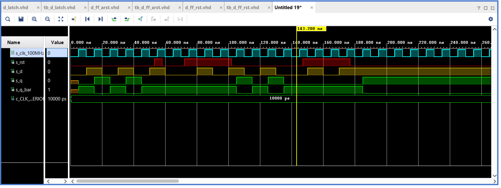
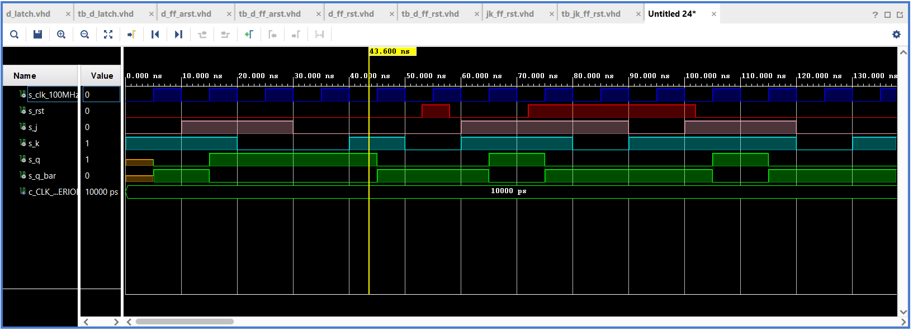
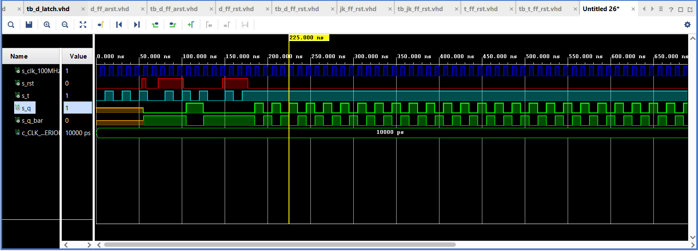

# Ivo Točený, 222683 - 07-ffs

## 0. part - Link to GitHub repository

[My GitHub 07-ffs repository](https://github.com/Ivo-Toceny-222683/Digital-electronics-1/tree/main/Labs/07-ffs)

## 1. part - Preparation tasks

### D flip-flop

   | **D** | **Qn** | **Q(n+1)** | **Comments** |
   | :-: | :-: | :-: | :-- |
   | 0 | 0 | 0 | No Change |
   | 0 | 1 | 0 | Reset |
   | 1 | 0 | 1 | Set |
   | 1 | 1 | 1 | No Change |
   
  
 ### JK flip-flop

   | **J** | **K** | **Qn** | **Q(n+1)** | **Comments** |
   | :-: | :-: | :-: | :-: | :-- |
   | 0 | 0 | 0 | 0 | No change |
   | 0 | 0 | 1 | 1 | No change |
   | 0 | 1 | 0 | 0 | Reset |
   | 0 | 1 | 1 | 0 | Reset |
   | 1 | 0 | 0 | 1 | Set |
   | 1 | 0 | 1 | 1 | Set |
   | 1 | 1 | 0 | 1 | Toggle |
   | 1 | 1 | 1 | 0 | Toggle |
   
   ### T flip-flop
   
   | **T** | **Qn** | **Q(n+1)** | **Comments** |
   | :-: | :-: | :-: | :-- |
   | 0 | 0 | 0 | No change |
   | 0 | 1 | 1 | No change |
   | 1 | 0 | 1 | Invert |
   | 1 | 1 | 0 | Invert |

## 2. part - D_latch

### VHDL code listing of the process p_d_latch

```vhdl
 p_d_latch : process(en, arst, d)
    begin
        if(arst = '1') then
            q     <= '0';
            q_bar <= '1';
        elsif(en = '1') then
            q     <= d;
            q_bar <= not d;
        end if;
    end process p_d_latch;
```

### Listing of VHDL reset and stimulus processes from the testbench tb_d_latch

```vhdl
p_reset_gen : process
    begin
        s_arst <= '0';
        wait for 53ns;
        
        s_arst <= '1';
        wait for 5ns;
        
        s_arst <= '0';
        
        wait for 108ns;
        s_arst <= '1';
        
        wait for 30ns;
        s_arst <= '0';
        
        wait;
    end process p_reset_gen;
    
    p_stimulus : process
    begin
        report "Stimulus process started" severity note;
        s_en <= '0';
        s_d  <= '0';
        
        wait for 10ns;
        s_d  <= '1';
        wait for 10ns;
        s_d  <= '0';
        wait for 10ns;
        s_d  <= '1';
        wait for 10ns;
        s_d  <= '0';
        wait for 10ns;
        s_d  <= '1';
        wait for 10ns;
        s_d  <= '0';
        wait for 10ns;
        
        s_en <= '1';
        
        wait for 3ns;
        assert(s_d = '0' and  s_arst = '0' and s_en = '1')
        report "Test failed for input combination: d='0', arst='0', en='1'." severity error;
        
        wait for 7ns;
        s_d  <= '1';
        wait for 10ns;
        s_d  <= '0';
        wait for 10ns;
        s_d  <= '1';
        
        wait for 3ns;
        assert(s_d = '1' and  s_arst = '0' and s_en = '1')
        report "Test failed for input combination: d='1', arst='0', en='1'." severity error;
        
        wait for 7ns;
        s_d  <= '0';
        wait for 10ns;
        s_d  <= '1';
        wait for 10ns;
        s_d  <= '0';
        wait for 10ns;
        
        s_en <= '0';
        
        wait for 3ns;
        assert(s_d = '0' and  s_arst = '0' and s_en = '0')
        report "Test failed for input combination: d='0', arst='0', en='0'." severity error;
        
        wait for 7ns;
        s_d  <= '1';
        wait for 10ns;
        
        s_en <= '1';
        
        s_d  <= '0';
        wait for 10ns;
        s_d  <= '1';
        
        wait for 3ns;
        assert(s_d = '1' and  s_arst = '1' and s_en = '1')
        report "Test failed for input combination: d='1', arst='1', en='1'." severity error;
        
        wait for 7ns;
        s_d  <= '0';
        wait for 10ns;
        s_d  <= '1';
        
        s_en <= '0';
        
        wait for 10ns;
        s_d  <= '0';
        wait for 10ns;
        
        s_en <= '1';
        
        wait for 10ns;
        s_d  <= '1';
        wait for 10ns;
        s_d  <= '0';
        wait for 10ns;
        
        s_en <= '0';
        
        s_d  <= '1';
        wait for 10ns;
        s_d  <= '0';
        wait for 10ns;
        
        s_en <= '1';
        
        s_d  <= '1';
        wait for 10ns;
        s_d  <= '0';
        wait for 10ns;
        
        s_en <= '0';
        
        report "Stimulus process finished" severity note;
        wait;
    end process p_stimulus;
```

### Screenshot with simulated time waveforms


## 3. part - Flip-flops

### D_ff_arst - p_d_ff_arst

```vhdl
p_d_ff_arst : process(clk, arst)
    begin
        if(arst = '1') then
            q     <= '0';
            q_bar <= '1';
        elsif rising_edge(clk) then
            q     <= d;
            q_bar <= not d;
        end if;
    end process p_d_ff_arst;
```

### D_ff_arst - reset and stimulus processes

```vhdl
p_reset_gen : process
    begin
        s_arst <= '0';
        wait for 53ns;
        
        s_arst <= '1';
        wait for 5ns;
        
        s_arst <= '0';
        
        wait for 14ns;
        s_arst <= '1';
        
        wait for 30ns;
        s_arst <= '0';
        
        wait for 45ns;
        s_arst <= '1';
        
        wait for 30ns;
        s_arst <= '0';
        
        wait;
    end process p_reset_gen;

     p_stimulus : process
    begin
        report "Stimulus process started" severity note;
        s_d  <= '0';
        
        wait for 10ns;
        s_d  <= '1';
        wait for 10ns;
        s_d  <= '0';
        wait for 10ns;
        s_d  <= '1';
        wait for 10ns;
        s_d  <= '0';
        wait for 10ns;
        s_d  <= '1';
        wait for 10ns;
        s_d  <= '0';
        wait for 10ns;
        
        wait for 3ns;
        assert(s_d = '0' and  s_arst = '1' and s_q = '0')
        report "Test failed for input combination: d='0', arst='1', s_q = '0'." severity error;
        
        wait for 7ns;
        s_d  <= '1';
        wait for 10ns;
        s_d  <= '0';
        wait for 10ns;
        s_d  <= '1';
        
        wait for 3ns;
        assert(s_d = '1' and  s_arst = '0' and s_q = '0')
        report "Test failed for input combination: d='1', arst='0', s_q = '0'." severity error;
        
        wait for 7ns;
        s_d  <= '0';
        wait for 10ns;
        s_d  <= '1';
        wait for 10ns;
        s_d  <= '0';
        wait for 10ns;
        
        wait for 3ns;
        assert(s_d = '0' and  s_arst = '0' and s_q = '0')
        report "Test failed for input combination: d='0', arst='0', s_q='0'." severity error;
        
        wait for 7ns;
        s_d  <= '1';
        wait for 10ns;
        
        s_d  <= '0';
        wait for 10ns;
        s_d  <= '1';
        
        wait for 3ns;
        assert(s_d = '1' and  s_arst = '1' and s_q = '0')
        report "Test failed for input combination: d='1', arst='1', s_q='0'." severity error;
        
        report "Stimulus process finished" severity note;
        wait;
    end process p_stimulus;
```

### D_ff_arst - waveforms



### D_ff_rst - p_d_ff_rst

```vhdl
p_d_ff_rst : process(clk)
    begin
        if rising_edge(clk) then         
            if(rst = '1') then
                q       <= '0';
                q_bar   <= '1';
            else
                q       <= d;
                q_bar   <= not d;
            end if;    
        end if;
    end process p_d_ff_rst;
```

### D_ff_rst - reset and stimulus processes

```vhdl
p_reset_gen : process
    begin
        s_rst <= '0';
        wait for 53ns;
        
        s_rst <= '1';
        wait for 5ns;
        
        s_rst <= '0';
        
        wait for 14ns;
        s_rst <= '1';
        
        wait for 30ns;
        s_rst <= '0';
        
        wait for 45ns;
        s_rst <= '1';
        
        wait for 30ns;
        s_rst <= '0';
        
        wait;
    end process p_reset_gen;

     p_stimulus : process
    begin
        report "Stimulus process started" severity note;
        s_d  <= '0';
        
        wait for 10ns;
        s_d  <= '1';
        wait for 10ns;
        s_d  <= '0';
        wait for 10ns;
        s_d  <= '1';
        wait for 10ns;
        s_d  <= '0';
        wait for 10ns;
        s_d  <= '1';
        wait for 10ns;
        s_d  <= '0';
        wait for 10ns;
        
        wait for 3ns;
        assert(s_d = '0' and  s_rst = '1' and s_q = '0')
        report "Test failed for input combination: d='0', rst='1', s_q = '0'." severity error;
        
        wait for 7ns;
        s_d  <= '1';
        wait for 10ns;
        s_d  <= '0';
        wait for 10ns;
        s_d  <= '1';
        
        wait for 3ns;
        assert(s_d = '1' and  s_rst = '0' and s_q = '0')
        report "Test failed for input combination: d='1', rst='0', s_q = '0'." severity error;
        
        wait for 7ns;
        s_d  <= '0';
        wait for 10ns;
        s_d  <= '1';
        wait for 10ns;
        s_d  <= '0';
        wait for 10ns;
        
        wait for 3ns;
        assert(s_d = '0' and  s_rst = '0' and s_q = '0')
        report "Test failed for input combination: d='0', rst='0', s_q='0'." severity error;
        
        wait for 7ns;
        s_d  <= '1';
        wait for 10ns;
        
        s_d  <= '0';
        wait for 10ns;
        s_d  <= '1';
        
        wait for 3ns;
        assert(s_d = '1' and  s_rst = '1' and s_q = '0')
        report "Test failed for input combination: d='1', rst='1', s_q='0'." severity error;
        
        report "Stimulus process finished" severity note;
        wait;
    end process p_stimulus;
```

### D_ff_rst - waveforms



### Jk_ff_rst - p_jk_ff_rst

```vhdl
p_jk_ff_rst : process(clk)
    begin
        if rising_edge(clk) then         
            if(rst = '1') then
                s_q   <= '0';
            else
                if(j = '0' and k = '0') then
                    s_q   <= s_q;
                elsif(j = '0' and k = '1') then
                    s_q   <= '0';
                elsif(j = '1' and k = '0') then
                    s_q   <= '1';
                else
                  s_q   <= not s_q;  
                end if;    
            end if;
        end if;
    end process p_jk_ff_rst;
```

### Jk_ff_rst - reset and stimulus processes

```vhdl
p_reset_gen : process
    begin
        s_rst <= '0';
        wait for 53ns;
        
        s_rst <= '1';
        wait for 5ns;
        
        s_rst <= '0';
        
        wait for 14ns;
        s_rst <= '1';
        
        wait for 30ns;
        s_rst <= '0';
        
        wait for 45ns;
        s_rst <= '1';
        
        wait for 30ns;
        s_rst <= '0';
        
        wait;
    end process p_reset_gen;

     p_stimulus : process
    begin
        report "Stimulus process started" severity note;
        s_j  <= '0';
        s_k  <= '1';
        
        wait for 10ns;
        s_j  <= '1';
        s_k  <= '1';
        wait for 10ns;
        s_j  <= '1';
        s_k  <= '0';
        wait for 10ns;
        s_j  <= '0';
        s_k  <= '0';
        wait for 10ns;
        s_j  <= '0';
        s_k  <= '1';
        wait for 10ns;
        s_j  <= '0';
        s_k  <= '0';
        wait for 10ns;
        s_j  <= '1';
        s_k  <= '1';
        wait for 10ns;
        
        wait for 3ns;
        assert(s_rst = '1' and s_q = '1' and s_j = '1' and s_k = '1')
        report "Test failed for input combination: rst='1', s_q = '1', j='1', k = '1'." severity error;
        
        wait for 7ns;
        s_j  <= '1';
        s_k  <= '0';
        wait for 10ns;
        s_j  <= '0';
        s_k  <= '1';
        wait for 10ns;
        s_j  <= '1';
        s_k  <= '1';
        
        wait for 3ns;
        assert(s_rst = '0' and s_q = '0' and s_j = '1' and s_k = '1')
        report "Test failed for input combination: rst='0', s_q = '0', j='1', k = '1'." severity error;
        
        wait for 7ns;
        s_j  <= '1';
        s_k  <= '1';
        wait for 10ns;
        s_j  <= '0';
        s_k  <= '0';
        wait for 10ns;
        s_j  <= '0';
        s_k  <= '1';
        wait for 10ns;
        
        wait for 3ns;
        assert(s_rst = '0' and s_q = '0' and s_j = '0' and s_k = '1')
        report "Test failed for input combination: rst='0', s_q = '0', j='0', k = '1'." severity error;
        
        wait for 7ns;
        s_j  <= '1';
        s_k  <= '0';
        wait for 10ns;
        
        s_j  <= '0';
        s_k  <= '1';
        wait for 10ns;
        s_j  <= '0';
        s_k  <= '0';
        
        wait for 3ns;
        assert(s_rst = '1' and s_q = '0' and s_j = '0' and s_k = '0')
        report "Test failed for input combination: rst='1', s_q = '0', j='0', k = '0'." severity error;
        
        report "Stimulus process finished" severity note;
        wait;
    end process p_stimulus;
```
### Jk_ff_rst - waveforms



### T_ff_rst - p_t_ff_rst

```vhdl
p_t_ff_rst : process(clk)
    begin
        if rising_edge(clk) then 
           if (rst = '1') then        
              s_q <= '0';
           else               
              if (t = '0') then
                    s_q  <= s_q;                                     
              else
                    s_q  <= not s_q;  
              end if;            
           end if;           
        end if;       
                                 
end process p_t_ff_rst;

    q     <= s_q;
    q_bar <= not s_q;
```

### T_ff_rst - reset and stimulus processes

```vhdl
p_reset_gen : process
    begin
        s_rst <= '0';
        wait for 53ns;
        
        s_rst <= '1';
        wait for 5ns;
        
        s_rst <= '0';
        
        wait for 14ns;
        s_rst <= '1';
        
        wait for 30ns;
        s_rst <= '0';
        
        wait for 45ns;
        s_rst <= '1';
        
        wait for 30ns;
        s_rst <= '0';
        
        wait;
    end process p_reset_gen;

     p_stimulus : process
    begin
        report "Stimulus process started" severity note;
        s_t  <= '0';
        
        wait for 10ns;
        s_t  <= '1';
        wait for 10ns;
        s_t  <= '0';
        wait for 10ns;
        s_t  <= '1';
        wait for 10ns;
        s_t  <= '0';
        wait for 10ns;
        s_t  <= '1';
        wait for 10ns;
        s_t  <= '0';
        wait for 10ns;
        
        wait for 3ns;
        assert(s_rst = '1' and  s_q = '0' and s_t = '0')
        report "Test failed for input combination: rst='1', q='0', t = '0'." severity error;
        
        wait for 7ns;
        s_t  <= '1';
        wait for 10ns;
        s_t  <= '0';
        wait for 10ns;
        s_t  <= '1';
        
        wait for 3ns;
        assert(s_rst = '0' and  s_q = '0' and s_t = '1')
        report "Test failed for input combination: rst='0', q='0', t = '1'." severity error;
        
        wait for 7ns;
        s_t  <= '0';
        wait for 10ns;
        s_t  <= '1';
        wait for 10ns;
        s_t  <= '0';
        wait for 10ns;
        
        wait for 3ns;
        assert(s_rst = '0' and  s_q = '0' and s_t = '0')
        report "Test failed for input combination: rst='0', q='0', t = '0'." severity error;
        
        wait for 7ns;
        s_t  <= '1';
        wait for 10ns;
        
        s_t  <= '0';
        wait for 10ns;
        s_t  <= '1';
        
        wait for 3ns;
        assert(s_rst = '1' and  s_q = '0' and s_t = '1')
        report "Test failed for input combination: rst='1', q='0', t = '1'." severity error;
        
        report "Stimulus process finished" severity note;
        wait;
    end process p_stimulus;
```

### T_ff_rst - waveforms



## 4. part - Shift register

