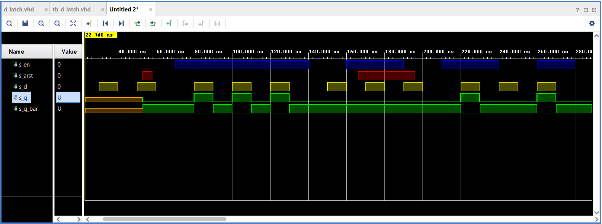

# Ivo Točený, 222683 - 07-ffs

## 0. part - Link to GitHub repository

[My GitHub 07-ffs repository](https://github.com/Ivo-Toceny-222683/Digital-electronics-1/tree/main/Labs/07-ffs)

## 1. part - Preparation tasks

## 2. part - D_latch

### VHDL code listing of the process p_d_latch

```vhld
 p_d_latch : process(en, arst, d)
    begin
        if(arst = '1') then
            q     <= '0';
            q_bar <= '1';
        elsif(en = '1') then
            q     <= d;
            q_bar <= not d;
        end if;
    end process p_d_latch;
```

### Listing of VHDL reset and stimulus processes from the testbench tb_d_latch

```vhdl
p_reset_gen : process
    begin
        s_arst <= '0';
        wait for 53ns;
        
        s_arst <= '1';
        wait for 5ns;
        
        s_arst <= '0';
        
        wait for 108ns;
        s_arst <= '1';
        
        wait for 30ns;
        s_arst <= '0';
        
        wait;
    end process p_reset_gen;
    
    p_stimulus : process
    begin
        report "Stimulus process started" severity note;
        s_en <= '0';
        s_d  <= '0';
        
        wait for 10ns;
        s_d  <= '1';
        wait for 10ns;
        s_d  <= '0';
        wait for 10ns;
        s_d  <= '1';
        wait for 10ns;
        s_d  <= '0';
        wait for 10ns;
        s_d  <= '1';
        wait for 10ns;
        s_d  <= '0';
        wait for 10ns;
        
        s_en <= '1';
        
        wait for 3ns;
        assert(s_d = '0' and  s_arst = '0' and s_en = '1')
        report "Test failed for input combination: d='0', arst='0', en='1'." severity error;
        
        wait for 7ns;
        s_d  <= '1';
        wait for 10ns;
        s_d  <= '0';
        wait for 10ns;
        s_d  <= '1';
        
        wait for 3ns;
        assert(s_d = '1' and  s_arst = '0' and s_en = '1')
        report "Test failed for input combination: d='1', arst='0', en='1'." severity error;
        
        wait for 7ns;
        s_d  <= '0';
        wait for 10ns;
        s_d  <= '1';
        wait for 10ns;
        s_d  <= '0';
        wait for 10ns;
        
        s_en <= '0';
        
        wait for 3ns;
        assert(s_d = '0' and  s_arst = '0' and s_en = '0')
        report "Test failed for input combination: d='0', arst='0', en='0'." severity error;
        
        wait for 7ns;
        s_d  <= '1';
        wait for 10ns;
        
        s_en <= '1';
        
        s_d  <= '0';
        wait for 10ns;
        s_d  <= '1';
        
        wait for 3ns;
        assert(s_d = '1' and  s_arst = '1' and s_en = '1')
        report "Test failed for input combination: d='1', arst='1', en='1'." severity error;
        
        wait for 7ns;
        s_d  <= '0';
        wait for 10ns;
        s_d  <= '1';
        
        s_en <= '0';
        
        wait for 10ns;
        s_d  <= '0';
        wait for 10ns;
        
        s_en <= '1';
        
        wait for 10ns;
        s_d  <= '1';
        wait for 10ns;
        s_d  <= '0';
        wait for 10ns;
        
        s_en <= '0';
        
        s_d  <= '1';
        wait for 10ns;
        s_d  <= '0';
        wait for 10ns;
        
        s_en <= '1';
        
        s_d  <= '1';
        wait for 10ns;
        s_d  <= '0';
        wait for 10ns;
        
        s_en <= '0';
        
        report "Stimulus process finished" severity note;
        wait;
    end process p_stimulus;
```

### Screenshot with simulated time waveforms

